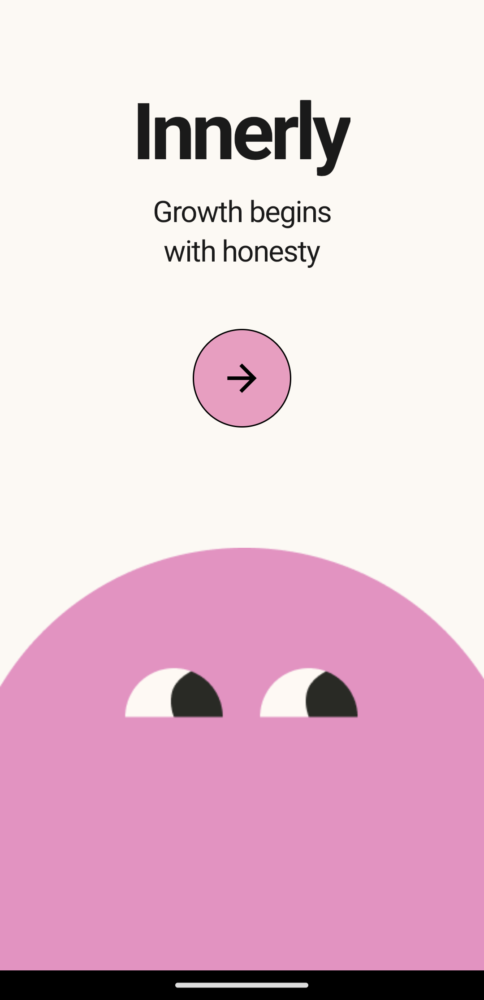
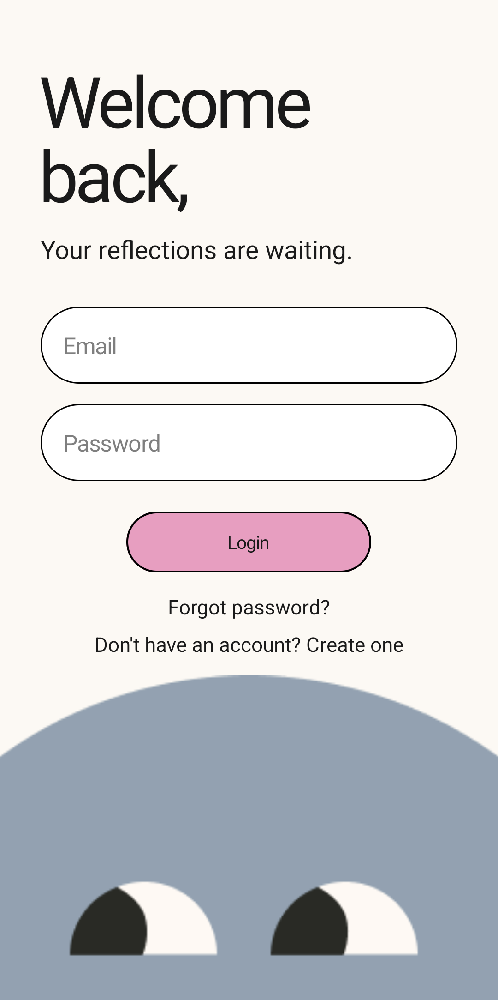
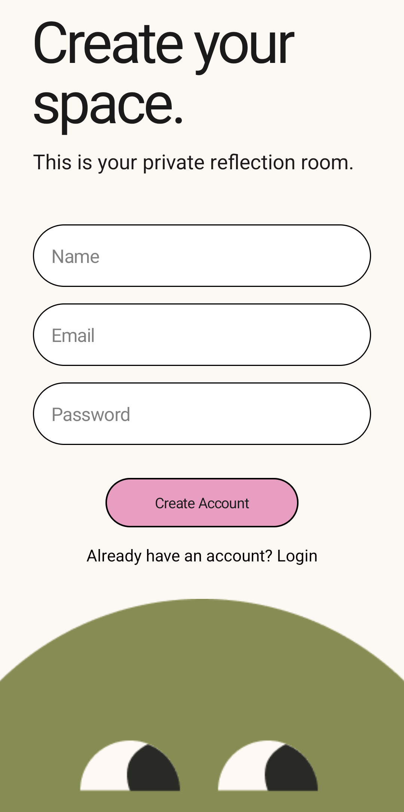
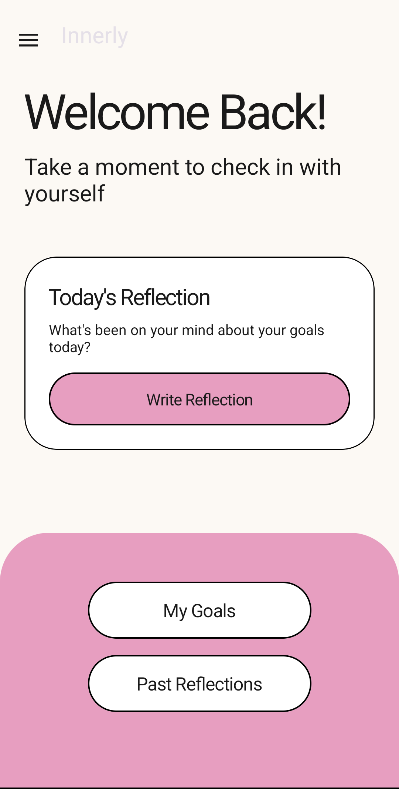
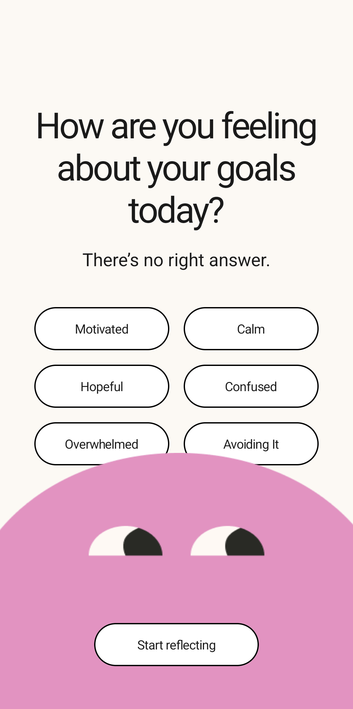
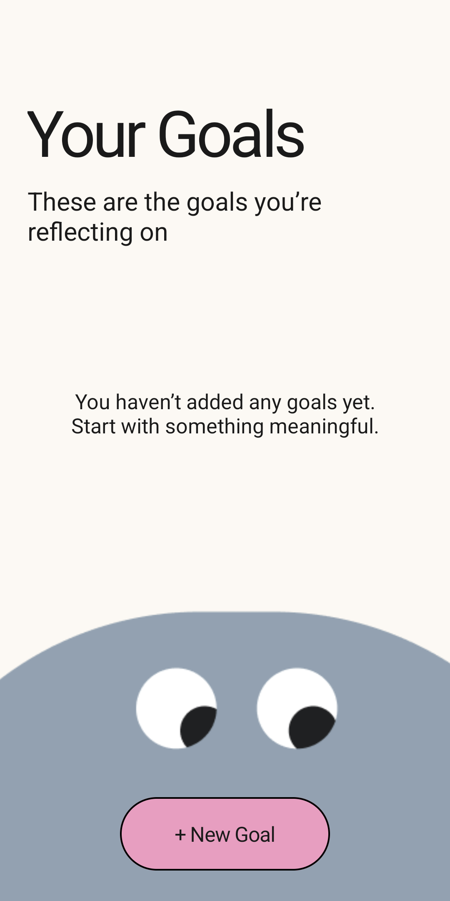

# 🌿 Innerly – Personal Goal Reflection Companion 🎯

<p align="center">
  <b>Growth Begins with Honesty • Reflect • Achieve • Evolve</b>
</p>

<p align="center">
  
  
  
  
</p>

---

## 📸 App Showcase

> **Note:** Create a folder named `screenshots` in your root directory and add your app images there to see them here.

<p align="center">
  
  
  
</p>
<p align="center">
  <i>Splash Screen, Login, and Registration</i>
</p>

<p align="center">
  
  
  
</p>
<p align="center">
  <i>Main Dashboard, Goal Reflection, and Achievement Archive</i>
</p>

---

## 🌍 About the Project
*Innerly* is a personalized goal-tracking and reflection application developed as part of the **ICT3214 - Mobile Application Development** module. 

Unlike standard To-Do apps, Innerly focuses on the **emotional journey** of achieving a goal. It provides users with a private space to document their progress, log their moods, and reflect on the lessons learned during their growth process.

This project demonstrates core Android development concepts, including secure local storage with **SQLite**, full **CRUD operations**, and **user-based data filtering**.

---

## 🚀 Project Highlights
✔ **Secure Authentication**: Registration and Login with SHA-256 password hashing.  
✔ **Local Persistence**: Robust SQLite database management using `SQLiteOpenHelper`.  
✔ **Full CRUD Functionality**: Create, Read, Update, and Delete goals seamlessly.  
✔ **Mood Integration**: Track your emotional state with every reflection.  
✔ **Privacy First**: Logged-in users can only access their personal data.  
✔ **Goal Archiving**: Mark goals as achieved and view them in a dedicated archive.  
✔ **Clean UI**: Minimalist and distraction-free Material Design.

---

## 🏥 Core Features

### 🔐 Authentication & Security
- Secure User Registration and Login system.
- Login session management using `SharedPreferences`.
- **Guideline Compliance**: Passwords are never stored in plain text (SHA-256 Encryption).

### 🎯 Goal Management
- Set new goals with titles and descriptions.
- Update goal details as you progress.
- Delete goals that are no longer relevant.
- View active goals on a clean, filtered dashboard.

### 💭 Daily Reflections
- Write honest reflections for each specific goal.
- Select a mood (Motivated, Calm, Overwhelmed, Proud, etc.) to record your feelings.
- View a chronological history of reflections for a particular goal.

### 📂 Achievement Archive
- Mark goals as "Achieved" once completed.
- Reflect on "Lessons Learned" during the completion process.
- Access all past successes in the dedicated Archive section.

---

## 🗄 Database Structure (SQLite)
The application utilizes a relational database structure with foreign key constraints to ensure data integrity:

- **Users Table**: Stores unique emails and hashed passwords.
- **Goals Table**: Stores user-specific objectives linked by `user_id`.
- **Reflections Table**: Stores thoughts and moods linked by `goal_id`.

---

## 🛠 Tech Stack
| Layer | Technology |
| :--- | :--- |
| **Language** | Java |
| **UI** | XML + Material Design |
| **Database** | SQLite (SQLiteOpenHelper) |
| **Security** | SHA-256 Hashing |
| **Version Control** | Git & GitHub |

---

## 👥 Team Members & Contributions

As per the project guidelines, the work was divided to ensure balanced contributions:

### **Member 01: [ඔබේ නම]**
- Initial project structure and Android configuration.
- SQLite Database foundation (`DatabaseHelper`).
- Authentication system (Registration & Login Logic).
- Security implementation (**SHA-256 Password Hashing**).
- Session Management (`SessionManager`).

### **Member 02: [සාමාජික 02 නම]**
- Core Goal Feature implementation (Goal Data Model).
- Goal CRUD operations (Create and Read logic).
- Dashboard UI design and RecyclerView implementation.
- `GoalAdapter` development for custom goal listing.

### **Member 03: [සාමාජික 03 නම]**
- Reflection system development (Reflections Table & Logic).
- Goal Details and "Update/Delete" functionality.
- Achievement Archive and `GoalAchievedActivity` logic.
- Final UI polish and Project Documentation (**README.md**).

---

## ⚙️ Installation
1. **Clone the repository**:
   ```bash
   git clone https://github.com/[your-username]/innerly.git
   ```
2. Open the project in **Android Studio**.
3. Build and run on an **Emulator** or **Physical Device**.
